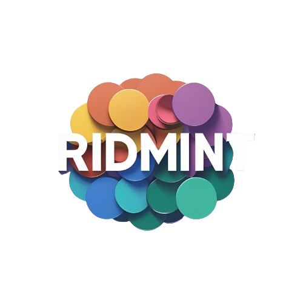

# Ridmint - Web3 Storytelling Platform



**Transform your stories into digital assets and build a community that invests in your creativity.**

Ridmint is a revolutionary Web3 platform that enables storytellers to mint their written works as ERC-20 tokens using Zora Coins SDK. Writers can monetize their creativity while fans can support their favorite creators by purchasing story-backed tokens.

## 🌟 Key Features

### For Storytellers
- **Story Tokenization**: Convert stories into unique ERC-20 tokens on Base Sepolia
- **Creative Freedom**: Maintain full ownership of intellectual property
- **Multiple Revenue Streams**: Earn from token sales, trading, and community engagement
- **Analytics Dashboard**: Track story performance and token metrics
- **Direct Fan Connection**: Build meaningful relationships with invested readers

### For Supporters
- **Creator Investment**: Support favorite authors by purchasing their story tokens
- **Exclusive Access**: Token holders get early access to new content and rewards
- **Potential Returns**: Token values may increase as stories gain popularity
- **Community Building**: Connect with fellow supporters and creators

### Platform Features
- **Blockchain Security**: Built on Ethereum with transparent smart contracts
- **Global Marketplace**: Reach readers worldwide through Web3
- **Instant Monetization**: Start earning immediately upon token minting
- **Responsive Design**: Optimized for all devices and screen sizes

## 🛠 Technology Stack

### Frontend
- **React 18** with TypeScript for type-safe development
- **Vite** for fast development and building
- **Tailwind CSS** for responsive, utility-first styling
- **React Router DOM** for client-side routing
- **Lucide React** for beautiful, consistent icons

### Web3 Integration
- **Wagmi** for Ethereum wallet connections and interactions
- **Viem** for Ethereum utilities and type-safe contract interactions
- **Zora Coins SDK** for ERC-20 token creation and minting
- **TanStack React Query** for efficient data fetching and caching

### Blockchain
- **Base Sepolia Testnet** for development and testing
- **ERC-20 Token Standard** for story tokenization
- **Smart Contracts** for secure, transparent transactions

### Data Storage
- **localStorage** (Current Implementation): Stories stored locally in browser

## 🚀 Getting Started

### Prerequisites
- Node.js 18+ and npm
- Modern web browser with wallet extension (MetaMask, Core Wallet, etc.)
- Base Sepolia testnet ETH for minting (get from [Base Sepolia Faucet](https://www.alchemy.com/faucets/base-sepolia))

### Installation

1. **Clone the repository**
   ```bash
   git clone https://github.com/Fatumayattani/ridmint.git
   cd ridmint
   ```

2. **Install dependencies**
   ```bash
   npm install
   ```

3. **Start development server**
   ```bash
   npm run dev
   ```

4. **Open in browser**
   Navigate to `http://localhost:5173`

### Environment Setup

The application works out of the box with localStorage.

## 🔗 Wallet Configuration

### Supported Wallets
- **MetaMask**: Browser extension wallet
- **Core Wallet**: Multi-chain browser wallet
- **Coinbase Wallet**: Coinbase's self-custody wallet
- **WalletConnect**: Protocol for connecting various wallets

### Network Configuration
- **Primary Network**: Base Sepolia (Chain ID: 84532)
- **Fallback Networks**: Ethereum Mainnet, Sepolia
- **Auto-switching**: Automatically prompts users to switch to Base Sepolia

### Wallet Connection Flow
1. Click "Connect Wallet" button
2. Select preferred wallet from modal
3. Approve connection in wallet extension
4. Automatic redirect to story creation page

## 📊 Data Storage Architecture

### Current Implementation: localStorage
- **Storage Location**: Browser's localStorage
- **Persistence**: Data survives browser restarts
- **Scope**: Device/browser specific
- **Capacity**: ~5-10MB typical limit
- **Backup**: Manual export/import (not implemented)

## 🤝 Contributing

### Development Workflow
1. Fork the repository
2. Create feature branch (`git checkout -b feature/amazing-feature`)
3. Commit changes (`git commit -m 'Add amazing feature'`)
4. Push to branch (`git push origin feature/amazing-feature`)
5. Open Pull Request

### Code Standards
- TypeScript for type safety
- ESLint for code quality
- Prettier for code formatting
- Conventional commits for clear history

## 📈 Roadmap

### Phase 1 (Current)
- ✅ Basic story creation and minting
- ✅ Wallet integration
- ✅ Local storage implementation
- ✅ Responsive design

### Phase 2 (Planned)
- [ ] Supabase integration activation
- [ ] User profiles and authentication
- [ ] Story categories and search
- [ ] Token trading interface

### Phase 3 (Future)
- [ ] Mobile app development
- [ ] Advanced analytics dashboard
- [ ] Creator monetization tools
- [ ] Community features

## 🐛 Known Issues

### Current Limitations
- Stories stored locally (not shared between devices)
- Testnet only (no real value transactions)
- Limited wallet provider testing
- No story backup/export functionality

### Workarounds
- Use same browser/device for consistency
- Keep transaction hashes for reference
- Test with multiple wallet providers
- Manual story content backup recommended

## 📞 Support

### Getting Help
- Check existing issues in repository
- Review documentation thoroughly
- Test on Base Sepolia testnet first
- Provide detailed error descriptions

### Common Issues
1. **Wallet Connection**: Ensure wallet extension is installed and unlocked
2. **Network Issues**: Switch to Base Sepolia testnet
3. **Transaction Failures**: Check sufficient testnet ETH balance
4. **Story Not Appearing**: Verify transaction confirmation

## 📄 License

This project is licensed under the MIT License - see the LICENSE file for details.

## 🙏 Acknowledgments

- **Zora** for the Coins SDK
- **Base** for the L2 infrastructure
- **Wagmi** team for Web3 React hooks
- **Tailwind CSS** for the utility-first framework
- **Vite** for the fast build tool

---

**Built with ❤️ for storytellers worldwide**

*Ridmint - Where stories become digital gold*